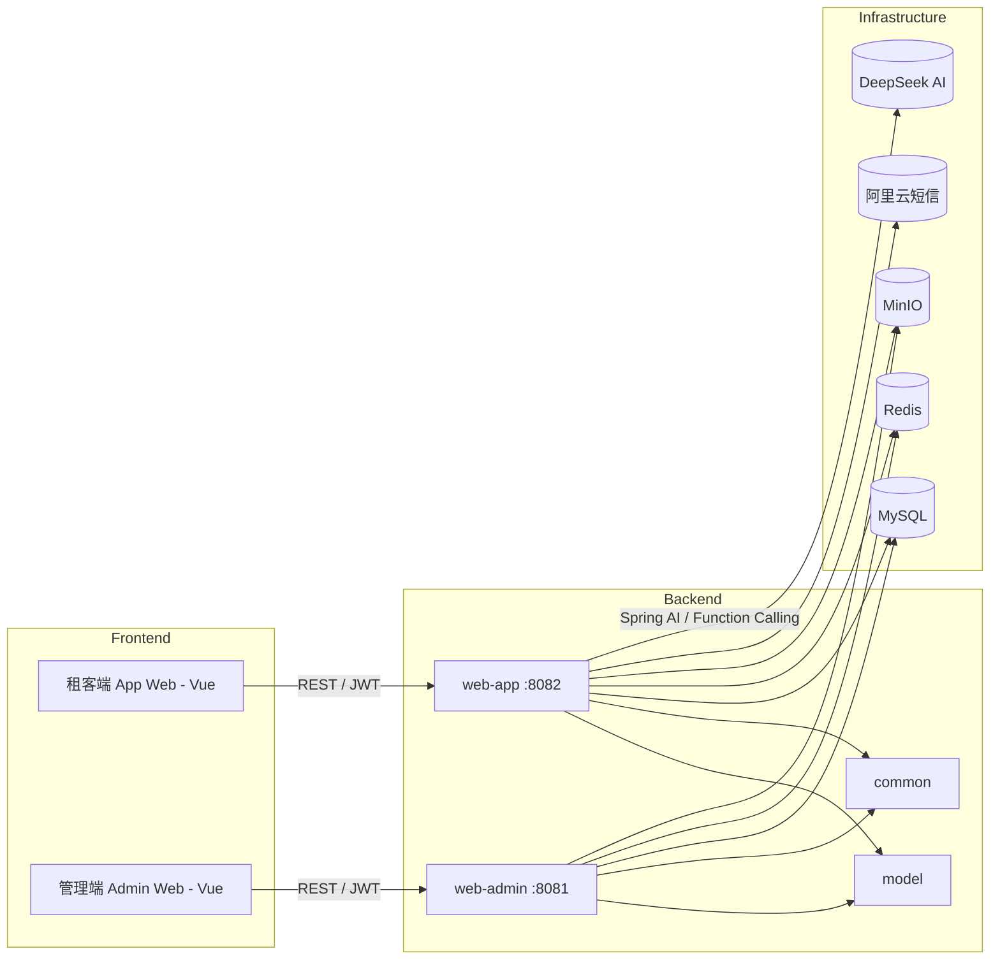

# 易选好寓 - 基于 Spring AI 的智能长租公寓管理平台

> 深度融合 **Spring AI + DeepSeek 大模型** 的新一代长租公寓 SaaS 平台，支持 AI 智能找房、多条件语音/对话推荐、会话记忆与位置感知，覆盖房源管理、预约看房、在线签约、多渠支付、报修工单、租户画像全链路业务。

## 项目亮点

- **Spring AI 深度集成** — 基于 Spring AI 框架对接 DeepSeek 大模型，实现 AI 对话式找房助手
- **Function Calling** — 注册 20+ 个业务查询函数，AI 可自主调用数据库查询公寓、房间、设施、租期、支付方式等
- **流式响应输出** — 采用 `Flux<String>` 实现 AI 回答逐字流式输出，提升交互体验
- **会话记忆** — 支持多轮上下文连续对话，AI 记住历史交流内容
- **位置感知推荐** — 结合用户地理位置（省市区 / 经纬度逆地理编码），优先推荐附近房源
- **多渠混合支付** — 支持纯支付宝、纯微信、余额+微信混合支付，原路退款
- **租户画像** — 活跃度 / 意向 / 价值 / 付款行为多维标签，辅助精细化运营
- **完整业务闭环** — 预约看房 → 签约 → 支付 → 报修 → 退租 / 续约，全流程线上化

## 技术栈

| 类别 | 技术 | 版本 |
|------|------|------|
| 语言 | Java | 17 |
| 框架 | Spring Boot | 3.3.8 |
| AI 框架 | **Spring AI** (OpenAI 协议) | 1.0.0-M5 |
| AI 模型 | **DeepSeek** (deepseek-chat) | — |
| ORM | MyBatis-Plus | 3.5.6 |
| 数据库 | MySQL | 8.x |
| 缓存 | Redis | 6.x |
| 对象存储 | MinIO（S3 兼容） | 8.x |
| 短信 | 阿里云 SMS | 2.0.23 |
| 接口文档 | Knife4j / OpenAPI 3 | 4.1.0 |
| 认证 | JWT (JJWT) | 0.11.2 |
| 验证码 | EasyCaptcha | 1.6.2 |
| 构建 | Maven 多模块 | 3.9+ |

## 项目结构

```
lease                                    # 父工程 (pom)
├── common                               # 公共组件层
│   ├── exception / result               # 全局异常 & 统一返回封装
│   ├── redis / minio / sms              # 中间件配置
│   ├── login                            # JWT 登录上下文 (ThreadLocal)
│   └── utils                            # JwtUtil / VerifyCodeUtil
├── model                                # 领域模型层
│   ├── entity (39个)                    # 数据库实体，继承 BaseEntity
│   ├── enums (16个)                     # 业务枚举，实现 BaseEnum + @EnumValue
│   ├── dto / vo                         # 数据传输 & 视图对象
└── web                                  # 业务模块聚合 (pom)
    ├── web-admin  :8081                 # 管理端 (19个控制器)
    └── web-app    :8082                 # 租客端 (17个控制器，含 AI 对话)
```

**模块依赖**：`web-admin` / `web-app` → `common` + `model` → Spring Boot Parent

## 快速开始

### 环境准备

- JDK 17+、Maven 3.9+
- MySQL 8.x、Redis 6.x、MinIO 8.x
- DeepSeek API Key（[申请地址](https://platform.deepseek.com)）
- 阿里云短信 AccessKey（可选）

### 构建与启动

```bash
# 1. 克隆项目
git clone <repo-url> && cd lease

# 2. 初始化数据库
mysql -u root -p -e "CREATE DATABASE lease DEFAULT CHARSET utf8mb4;"
mysql -u root -p lease < lease.sql

# 3. 修改配置（数据库/Redis/MinIO/API Key 等）
#    web/web-app/src/main/resources/application.yml
#    web/web-admin/src/main/resources/application.yml

# 4. 构建
mvn clean install

# 5. 启动
mvn spring-boot:run -pl web/web-app -am    # 租客端 :8082
mvn spring-boot:run -pl web/web-admin -am  # 管理端 :8081
```

### 访问入口

| 服务 | 地址 | 说明 |
|------|------|------|
| 租客端接口文档 | http://localhost:8082/doc.html | Knife4j 在线调试 |
| 管理端接口文档 | http://localhost:8081/doc.html | Knife4j 在线调试 |
| AI 对话接口 | POST /app/ai/test/function | 流式响应 |

## 核心功能

### AI 智能对话助手（Spring AI + DeepSeek）

项目核心亮点功能，基于 Spring AI 的 `ChatClient` 构建智能找房助手「小易」：

```
用户: "帮我找一下月租2000以下、朝南的房间"
  ↓
AI 自动调用 Function Calling:
  → roomByMultiConditionOperation (多条件组合查询)
  → roomByRentRangeOperation (租金范围筛选)
  ↓
AI: "为您找到以下符合条件的房间：..."
```

**已注册的 Function Calling 能力（20+）：**

| 类别 | 能力 |
|------|------|
| 公寓查询 | 按名称/省市区/介绍查询公寓、按 ID 查详情 |
| 房间查询 | 按 ID/公寓/区域查询房间、按公寓名查房间列表 |
| 条件筛选 | 按租金范围/面积范围/支付方式/租期/多条件组合筛选 |
| 属性配套 | 查询房间属性值、配套设施、租期、支付方式 |
| 状态查询 | 查询房间发布状态、可租房源列表 |

**AI 技术特性：**
- `Flux<String>` 流式输出，逐字返回回答内容
- `ConcurrentHashMap` 会话存储，支持多用户并发对话
- 对话历史自动管理（保留最近 20 轮），避免上下文过长
- 位置感知：解析省市区地址 / 经纬度逆地理编码（高德地图 API）
- 系统提示词工程：定义 AI 角色、能力边界和推荐策略

### 租客端功能

| 模块 | 功能 |
|------|------|
| 登录 | 手机号 + 短信验证码（阿里云 SMS），JWT 鉴权 |
| 房源浏览 | 公寓/房间详情查看，条件筛选（区域、租金、租期） |
| AI 找房 | 对话式智能找房，多条件筛选，位置感知推荐 |
| 预约看房 | 创建/查看/更新预约单 |
| 租约管理 | 查看租约、确认签约、申请退租、续约 |
| 账单支付 | 查看账单、支付宝/微信/混合支付、退款 |
| 报修服务 | 提交报修（含附件）、查看进度、撤销 |
| 个人中心 | 房间收藏、浏览历史、资料编辑、头像上传 |

### 管理端功能

| 模块 | 功能 |
|------|------|
| 登录 | 账号密码 + 图形验证码（EasyCaptcha），JWT 鉴权 |
| 公寓管理 | CRUD、发布/取消、关联配套/标签/杂费/图片 |
| 房间管理 | CRUD、发布/取消、关联属性/配套/标签/租期/支付方式 |
| 基础配置 | 属性、配套、杂费、标签、租期、支付方式管理 |
| 租约管理 | 创建租约、状态审核（签约/退租/续约确认） |
| 预约管理 | 查看预约、更新状态 |
| 报修管理 | 指派处理人、添加进度、更新状态 |
| 支付管理 | 订单查看、手动关闭/确认 |
| 用户管理 | 租客账号管理、后台用户与岗位管理 |
| 租户画像 | 多维标签画像（活跃度/意向/价值/付款行为） |
| 文件上传 | MinIO 对象存储 |

## 架构设计



### 关键技术设计

| 设计点 | 实现方案 |
|--------|----------|
| ORM | MyBatis-Plus，实体继承 `BaseEntity`（id / create_time / update_time / is_deleted），自动填充 + 逻辑删除 |
| 认证 | JWT Token 存储于 Redis，管理端 EasyCaptcha 图形验证码，租客端阿里云短信验证码 |
| 枚举 | 实现 `BaseEnum` 接口 + `@EnumValue` 注解，MyBatis-Plus 自动转换 |
| 统一响应 | `Result<T>` + `ResultCodeEnum` 封装所有接口返回 |
| 异常处理 | `GlobalExceptionHandler`（`@RestControllerAdvice`）统一捕获业务异常和系统异常 |
| 登录上下文 | `LoginUserHolder` 基于 `ThreadLocal` 存储当前登录用户 |
| AI 集成 | Spring AI `ChatClient` + `Function Calling` + 流式响应 + 会话记忆 + 位置感知 |
| 支付 | 统一支付接口，支持支付宝/微信/混合支付，原路退款，`PaymentDetail` 明细拆分 |

## 数据库概要

共 **39 张表**，分为以下类别：

| 分类 | 主要表 |
|------|--------|
| 基础数据（11） | province_info, city_info, district_info, facility_info, label_info, attr_key, attr_value, fee_key, fee_value, lease_term, payment_type |
| 房源核心（3） | apartment_info, room_info, graph_info |
| 关联关系（8） | apartment_facility, apartment_label, apartment_fee_value, room_attr_value, room_facility, room_label, room_lease_term, room_payment_type |
| 用户体系（4） | user_info, system_user, system_post, user_balance |
| 交易核心（6） | lease_agreement, rent_bill, payment_order, payment_detail, refund_record, balance_transaction |
| 交互行为（6） | view_appointment, browsing_history, room_collect, repair_request, repair_progress, repair_attachment |
| 数据分析（1） | tenant_profile_features |

初始化脚本：项目根目录 `lease.sql`

## 开发与调试

```bash
# 运行测试
mvn test

# 指定模块测试
mvn test -pl web/web-app

# 跳过测试构建
mvn clean install -DskipTests

# 打包
mvn package -DskipTests
java -jar web/web-admin/target/web-admin-*.jar  # 管理端
java -jar web/web-app/target/web-app-*.jar      # 租客端
```

- SQL 调试日志默认开启 `StdOutImpl`，可在 `application.yml` 中关闭
- JWT 调试：登录获取 Token，后续请求携带 `Authorization: Bearer <token>`

## 常见问题

| 问题 | 解决方案 |
|------|----------|
| AI 对话无响应 | 检查 DeepSeek API Key 有效性、调用额度、网络连通性 |
| AI 回答不准确 | 调整 `temperature` 参数（当前 0.7），优化系统提示词 |
| 短信验证码失败 | 检查阿里云 SMS 配置、Redis 可用性、网络连通性 |
| MinIO 上传失败 | 确认 bucket 存在、AccessKey/Secret 正确、访问策略已配置 |
| 修改端口 | 在 `application.yml` 中调整 `server.port`，或启动参数 `--server.port=` |

## 更多文档

- [需求规格说明书](./需求规格说明书.txt) — 完整功能需求与非功能需求定义
- [项目设计文档](./项目设计文档.txt) — 系统架构、数据库设计、接口设计、核心业务逻辑
- [用户文档说明书](./用户文档说明书.txt) — 管理端与租客端操作指南

## 参与贡献

1. Fork 本仓库
2. 创建特性分支：`git checkout -b feat/<feature-name>`
3. 提交代码：`git commit -m "feat: add xxx"`
4. 推送分支：`git push origin feat/<feature-name>`
5. 发起 Pull Request

## 许可证

本项目遵循企业内部许可证。若需开源，请补充许可证信息（如 MIT、Apache 2.0 等）。
