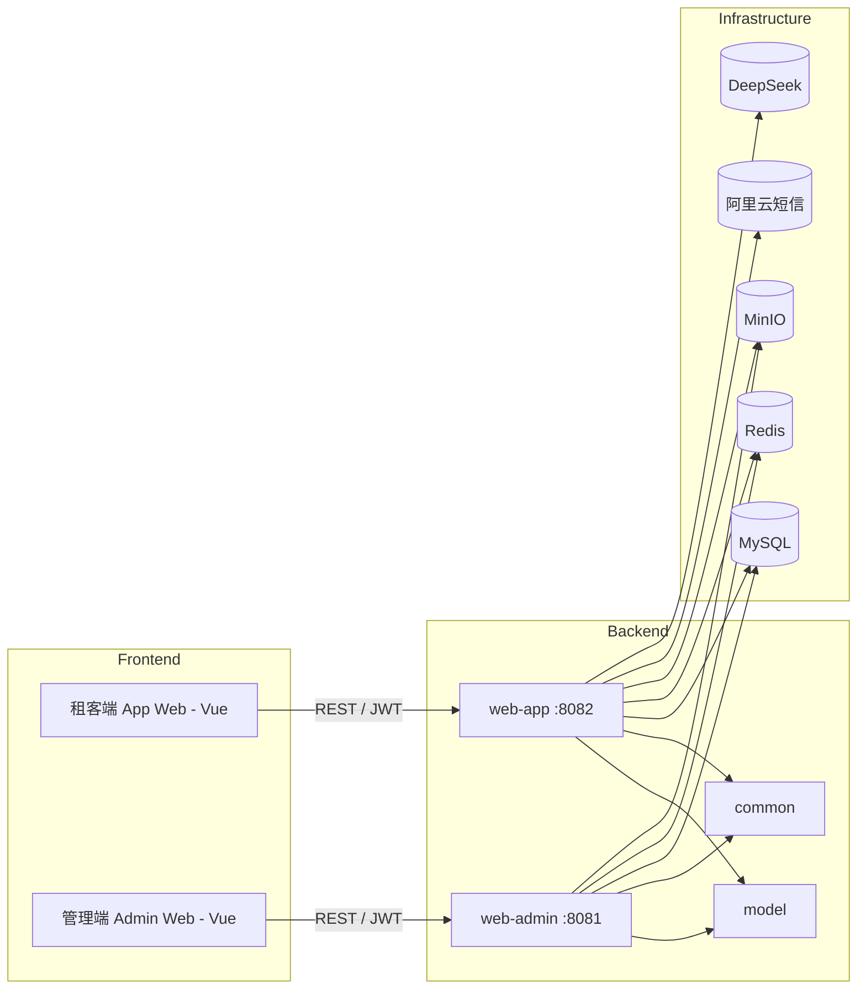

# 易选好寓（Lease Platform）

面向长租公寓业务的前后端分离解决方案，基于 **Spring Boot 3 + Vue** 构建。项目提供租客端（App Web）与管理端（Admin Web）两套应用，实现房源展示、预约签约、账单支付及后台运营管理。

## 技术栈

| 类别 | 技术 | 版本 |
|------|------|------|
| 语言 & 运行时 | JDK | 17 |
| 框架 | Spring Boot | 3.3.8 |
| ORM | MyBatis-Plus | 3.5.6 |
| 数据库 | MySQL | 8.x |
| 缓存 | Redis | 6.x |
| 对象存储 | MinIO（S3 兼容） | 8.x |
| 短信通知 | 阿里云短信 SDK | 2.0.23 |
| AI 能力 | DeepSeek（Spring AI OpenAI 协议） | 1.0.0-M5 |
| 接口文档 | Knife4j / OpenAPI 3 | 4.1.0 |
| 认证 | JJWT | 0.11.2 |
| 验证码 | EasyCaptcha | 1.6.2 |
| 构建工具 | Maven（多模块） | 3.9+ |

## 项目结构

```
lease                              # 父工程，统一依赖版本管理
├── common                         # 公共组件
│   └── exception / result / redis / minio / sms / login / utils
├── model                          # 领域模型
│   └── entity / enums / dto / vo
└── web                            # 业务模块聚合
    ├── web-admin                  # 管理端后端服务（端口 8081）
    └── web-app                    # 租客端后端服务（端口 8082）
```

**依赖关系**：`web-admin` / `web-app` 依赖 `common` + `model`，所有模块继承 Spring Boot Parent。

## 快速开始

### 环境准备

- JDK 17+、Maven 3.9+
- MySQL 8.x、Redis 6.x、MinIO
- 阿里云短信服务、DeepSeek API Key（按需）

### 构建与启动

```bash
# 1. 克隆代码
git clone <repo-url> && cd lease

# 2. 初始化数据库：创建 lease 数据库并导入根目录 lease.sql

# 3. 修改配置文件中的连接信息（见下方"配置说明"）

# 4. 构建
mvn clean install

# 5. 启动服务
mvn spring-boot:run -pl web/web-app -am    # 租客端 :8082
mvn spring-boot:run -pl web/web-admin -am  # 管理端 :8081
```

### 配置说明

配置文件位于各模块 `src/main/resources/application.yml`：

| 配置项 | 文件 |
|--------|------|
| 租客端 | `web/web-app/src/main/resources/application.yml` |
| 管理端 | `web/web-admin/src/main/resources/application.yml` |

需根据实际环境修改：
- **数据源**：MySQL 连接地址、账号密码
- **Redis**：地址与端口
- **MinIO**：endpoint、access-key、secret-key、bucket-name
- **阿里云短信**：access-key-id、access-key-secret
- **DeepSeek**：api-key、base-url

> 建议通过环境变量或配置中心注入敏感信息，避免明文提交。

## 功能概览

### 租客端（web-app，端口 8082）

- **手机号 + 短信验证码登录**，JWT Token 鉴权
- 房源搜索与筛选，查看详情与图片
- 预约看房，提交预约单
- 在线租赁，提交租约申请，查看合同与账单
- AI 智能咨询（DeepSeek）
- 个人中心：收藏、浏览记录、个人信息管理

### 管理端（web-admin，端口 8081）

- **账号密码 + 图形验证码登录**，JWT Token 鉴权
- 公寓与房源管理：维护公寓信息、房间属性、配套设施
- 租约与账单管理：审核租约、处理账单、退款
- 文件上传：房源图片与合同附件存储至 MinIO
- 用户管理：查看租客信息、禁用异常账号
- 定时任务：账单生成、到期提醒等（`@EnableScheduling`）

## 架构设计



### 关键设计

- **ORM**：MyBatis-Plus，实体继承 `BaseEntity`（id / create_time / update_time / is_deleted），自动填充由 `MybatisMetaObjectHandler` 处理，逻辑删除字段为 `is_deleted`
- **认证**：JWT Token 存储于 Redis，管理端使用 EasyCaptcha 图形验证码，租客端使用阿里云短信验证码
- **枚举**：实现 `BaseEnum` 接口，`@EnumValue` 标注存储值，MyBatis-Plus 自动转换
- **统一响应**：`Result<T>` + `ResultCodeEnum` 封装所有接口返回
- **异常处理**：`GlobalExceptionHandler` 统一捕获 `LeaseException` 及系统异常
- **登录上下文**：`LoginUserHolder` 基于 ThreadLocal 存储当前登录用户信息

## 开发与调试

- 启动后访问 `http://localhost:<port>/doc.html` 查看 Knife4j 接口文档
- MyBatis-Plus SQL 日志已默认开启 `StdOutImpl`，可在 `application.yml` 中关闭
- JWT 调试：通过登录接口获取 Token，后续请求携带 `Authorization: Bearer <token>`

### 运行测试

```bash
# 运行全部测试
mvn test

# 运行指定模块测试
mvn test -pl web/web-app

# 运行单个测试类
mvn test -pl web/web-app -Dtest=ClassName

# 跳过测试
mvn clean install -DskipTests
```

## 常见问题

| 问题 | 排查方向 |
|------|----------|
| 验证码发送失败 | 检查阿里云短信配置、网络连通性、Redis 可用性 |
| MinIO 上传报错 | 确认 bucket 存在、AccessKey/Secret 正确、访问策略已配置 |
| AI 咨询无响应 | 检查 DeepSeek API Key 有效性及调用额度 |
| 修改端口 | 在对应 `application.yml` 中调整 `server.port`，或启动参数 `--server.port=` |

## 更多文档

- [需求规格说明书](./需求规格说明书.txt)
- [项目设计文档](./项目设计文档.txt)
- [用户文档说明书](./用户文档说明书.txt)

## 参与贡献

1. Fork 本仓库
2. 创建特性分支：`git checkout -b feat/<feature-name>`
3. 提交代码：`git commit -m "feat: add xxx"`
4. 推送分支：`git push origin feat/<feature-name>`
5. 发起 Pull Request

## 许可证

本项目遵循企业内部许可证。若需开源，请补充许可证信息（如 MIT、Apache 2.0 等）。
